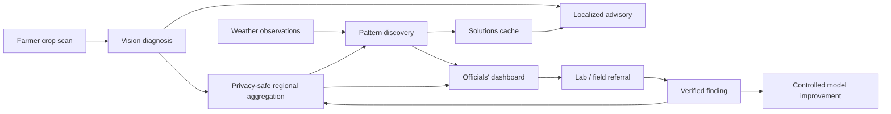

# Wellfarm

**Early crop disease and pest detection connected to regional outbreak intelligence.**

Wellfarm is a proposed Smart India Hackathon solution for problem statement **SIH26131**, issued by the Government of Maharashtra's Maharashtra State Innovation Society. It is intended to help farmers identify crop problems earlier while giving agriculture officials a live, privacy-aware view of emerging regional patterns.

> This repository currently contains the product definition, system architecture, contracts, safe demo data, and implementation scaffolding for the Round 1 prototype. It is not yet a production diagnosis system.

## Why this project exists

A crop scan is more valuable when it can safely inform nearby communities. Existing diagnosis tools can help an individual farmer identify visible symptoms, but Wellfarm's central idea is to connect anonymized scans, weather observations, government response, and laboratory verification into one feedback loop.

The system is designed to reduce delayed diagnosis, inappropriate pesticide use, avoidable cost, yield loss, and the lack of timely outbreak visibility for officials. It provides decision support and does not replace qualified agricultural or laboratory expertise.

## What Wellfarm will do

- Let farmers photograph crop symptoms and receive a probable classification.
- Turn structured findings into simple, localized, regional-language guidance.
- Aggregate anonymized reports into geographic outbreak signals.
- Compare outbreak history with temperature, humidity, and rainfall windows.
- Show officials state- and district-level severity on an accessible map.
- Reuse validated recurring solutions through a cache.
- Route moderate- and high-risk cases to an appropriate nearby laboratory.
- Feed verified field and lab outcomes back into controlled model improvement.
- Generate monthly summaries for government planning and field surveys.

## How it fits together



Read the [full architecture](docs/architecture.md) and [product requirements](docs/product-requirements.md) for details.

## Round 1 deliverable

The first prototype deliberately mixes working features with clearly labeled simulations:

| Area | Round 1 target |
| --- | --- |
| Farmer scan flow | Working UI and limited image model |
| Localized advisory | Real LLM request on sample structured input |
| Officials' dashboard | Working map using synthetic district records |
| Retraining and solutions cache | Mocked cycle with an explainable cache hit |
| Weather correlation | Simulated output from a defined analytical approach |
| Lab routing and field surveys | Architecture and walkthrough |

The guiding principle is simple: interactions shown as working should genuinely work, and synthetic inputs should always say **Demo data**.

## Repository structure

```text
apps/             Farmer app and officials' dashboard
services/         API, vision, advisory, and collective intelligence boundaries
packages/         Contracts shared between applications and services
data/             Schemas and non-sensitive synthetic fixtures
infrastructure/   Future deployment definitions and operational guidance
docs/             Requirements, architecture, decisions, safety, and roadmap
```

## Getting started

The technology stack has intentionally not been locked before the team evaluates its prototype constraints. To begin contributing now:

1. Read the [product requirements](docs/product-requirements.md).
2. Review the [architecture](docs/architecture.md) and [roadmap](docs/roadmap.md).
3. Choose a workstream from an app or service README.
4. Copy `.env.example` to `.env` only after a runnable component is introduced.
5. Keep real credentials, farmer images, private locations, and model binaries out of Git.

## Safety, privacy, and responsible use

- Display uncertainty and unsupported-image states instead of forcing a diagnosis.
- Do not generate pesticide dosage or regulatory guidance without approved sources.
- Minimize precise location collection and separate identity from analytical data.
- Require qualified review for high-impact recommendations and model releases.
- Track dataset licensing, provenance, geographic coverage, and evaluation leakage.
- Treat weather correlations as associations, not proof of causation.

See [SECURITY.md](SECURITY.md) before handling vulnerabilities or sensitive information.

## Project status

Wellfarm is at the **Round 1 idea, architecture, and prototype-foundation stage**. The [roadmap](docs/roadmap.md) separates the hackathon demo from pilot and production requirements.

## Contributing

The current team has six members covering core implementation, dataset research, testing, documentation, and presentation. See [CONTRIBUTING.md](CONTRIBUTING.md) for a lightweight collaboration workflow.

## License

Repository code and documentation are available under the [MIT License](LICENSE). Third-party datasets and models retain their own licenses and must be reviewed separately before use.
