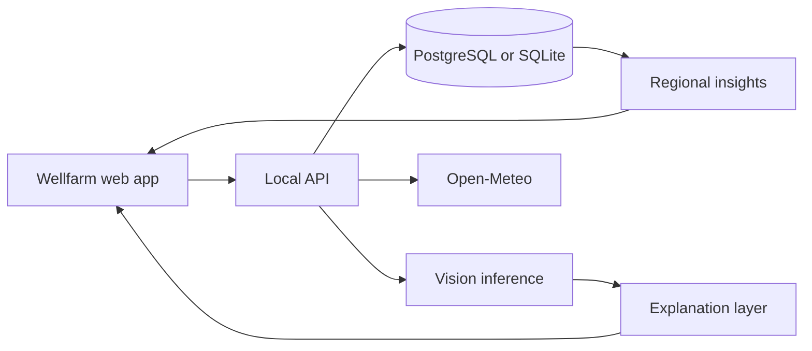

# Wellfarm Architecture

Wellfarm uses a modular local-first architecture so the web experience, API, machine-learning pipeline, and data contracts can evolve independently without pretending to operate external services.



## Boundaries

```text
apps/
  farmer-app/             Crop scanning and personal fieldbook boundary
  insights-dashboard/     Aggregate pattern exploration boundary

platform/replit/
  artifacts/wellfarm/     Runnable React application
  artifacts/api-server/   Local HTTP API
  lib/                    Generated contracts and database package

services/
  vision/                 Dataset preparation, training, evaluation, inference
  advisory/               Plain-language explanation from structured evidence
  intelligence/           Aggregate calculations and severity rules
  api/                    API boundary documentation

data/
  raw/                    Local source datasets; ignored by Git
  processed/              Generated manifests; ignored by Git
  samples/                Safe sample records for UI development and tests
  schemas/                Machine-readable contracts
```

## Scan flow

1. The browser validates the image and requests approximate location permission.
2. The API stores the image reference, crop context, symptoms, and privacy-reduced location.
3. The vision service returns ranked labels, calibrated confidence, model version, and quality flags.
4. Weather adds independent context from Open-Meteo.
5. The explanation layer converts structured evidence into readable guidance without inventing a diagnosis or chemical prescription.
6. The saved result appears in the user's fieldbook.

## Regional insight flow

1. Eligible local scan records are reduced to coarse geographic cells.
2. Duplicate and stale records are filtered.
3. Documented rules compute an informational severity level.
4. The insights UI shows aggregate counts and contributing evidence.
5. No external recipient is contacted and no operational case is created.

## Data and privacy

- Exact coordinates are used only for immediate local context and are reduced before aggregation.
- Uploaded images, databases, secrets, manifests, and model weights remain ignored by Git.
- Regional screens use sample records until a user intentionally creates sufficient local data.
- The system has no laboratory, government, referral, or third-party submission adapter.

## Deployment direction

The web application and API may run together for local development. A hosted portfolio deployment can separate static frontend hosting, a small API service, object storage, and PostgreSQL, subject to free-tier limits and clear data-retention controls.
