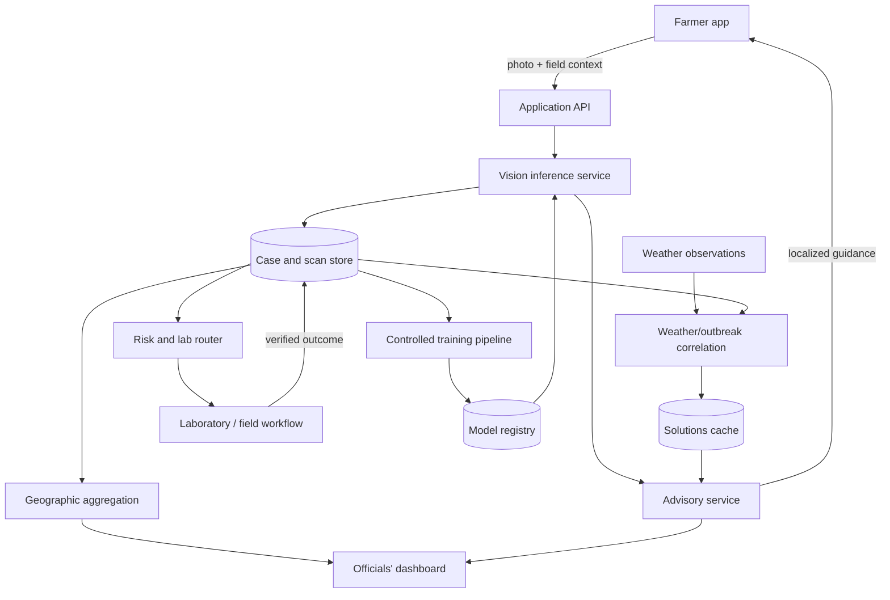

# System Architecture

AgriSentinel is designed as a modular platform so the Round 1 demo can use simulations while keeping the path to a validated pilot explicit.



## Repository map

```text
apps/
  farmer-app/             Farmer-facing mobile/web client
  officials-dashboard/    Geographic monitoring and reporting UI
services/
  api/                    Authentication, case, reporting, and routing APIs
  vision/                 Image preprocessing and disease/pest inference
  advisory/               Localized farmer and official recommendations
  intelligence/           Aggregation, correlation, caching, and retraining jobs
packages/
  contracts/              Shared API and event schemas
data/
  samples/                Safe synthetic demo fixtures
  schemas/                Dataset documentation and validation schemas
infrastructure/           Deployment and environment templates
docs/                     Product, architecture, safety, and contribution docs
```

## Core flows

### Scan and advice

1. The client captures a photo, crop type, approximate location, and optional symptoms.
2. The API removes unnecessary metadata, validates consent, and creates a case.
3. The vision service returns ranked labels, confidence, and model version.
4. The advisory service checks the solutions cache, then produces localized guidance from approved structured facts.
5. The client displays uncertainty, safe next steps, and escalation guidance.

### Regional intelligence

1. Authorized jobs aggregate anonymized cases into sufficiently large geographic groups.
2. Severity combines report volume, confidence, recency, and verified outcomes.
3. The intelligence service relates outbreak series to temperature, humidity, and rainfall windows.
4. Officials see the resulting signal and recommended response, not an unsupported causal claim.

### Verification and learning

1. Cases at or above the referral threshold are matched to an appropriate nearby lab.
2. Lab or field staff record verified labels and notes.
3. New verified records enter a versioned training dataset.
4. A controlled pipeline evaluates candidate models before any deployment.
5. The current model remains available for rollback.

## Round 1 deployment

The prototype may run all interfaces and mock services locally. Synthetic fixtures should drive the district map, retraining log, cache example, weather signature, and lab referral. The image classifier and LLM request can be real but must display model limitations.

## Production considerations

- Use a spatially enabled relational database for cases, districts, and lab proximity.
- Store images in encrypted object storage with short-lived access URLs.
- Use a queue for inference, reports, referrals, and training jobs.
- Keep personally identifying data separate from anonymized analytical records.
- Require review for high-impact advisories and model promotions.
- Log input provenance, prompt/template version, model version, and human verification.

